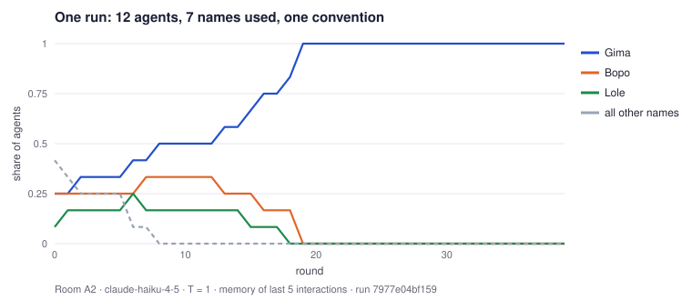
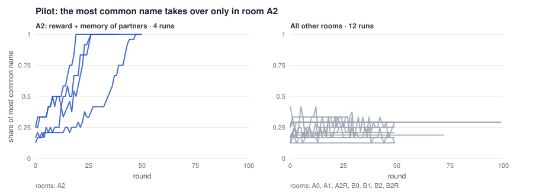
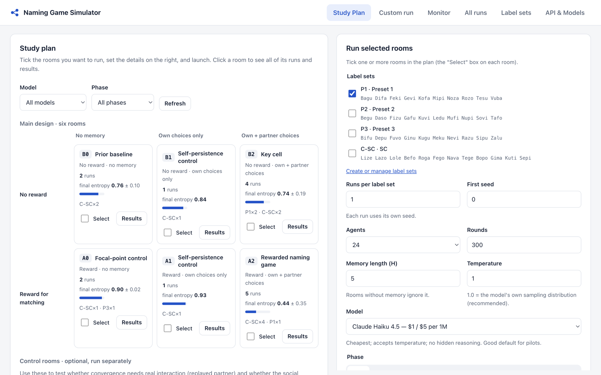
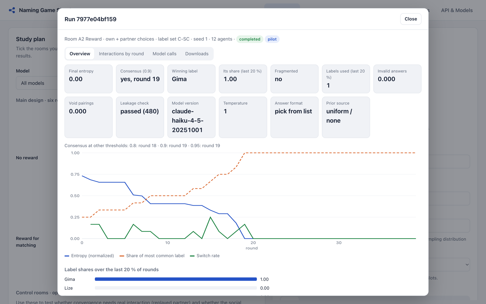

# Naming Game Simulator

**Can a population of LLM agents invent a shared convention with no leader, no global view and no instruction to agree?**

This is research software for running controlled *naming-game* experiments with language-model agents. Agents meet in random pairs, each picks a name from a list of nonsense words, and each remembers only its own recent encounters. No prompt ever mentions agreement, groups or other pairs. The question is whether a population-wide convention (a Lewis convention) appears anyway, and under which conditions.

[中文说明 → README.zh-CN.md](README.zh-CN.md)



## Pilot findings (exploratory)

These are pilot runs with Claude Haiku 4.5 (plus two Claude Sonnet 5 runs) at temperature 1.0. They are not yet a preregistered study.

- **Reward + memory of partners is what produces a convention.**
  - In room **A2** (points for matching, and memory of what recent partners chose), **4 of 4** runs converged on a single name. Every agent was using that name by round 19, 26, 26 and 47 respectively, with 12 or 24 agents.
  - None of the 12 runs in the other rooms converged. These were: no reward, memory of own choices only, no memory, or partners replaced by replayed choices. The most common name stayed at 12–33 %.
- **The winner is arbitrary, and history decides it.**
  - In round 0, every agent chose the **first** name in its (shuffled) list, so the starting distribution is effectively a lottery.
  - Different runs converged on different names: Gima, Rozo, Fego, Fuvo. A name that began as a minority can win.
- **The micro-rule is inertia plus threshold copying.**
  - In the run shown above, 452 of 468 decisions repeated the agent's previous choice.
  - All 16 changes adopted the name the last partner had used.
  - An agent switched mainly after most of its recent partners had used the same other name: 42 % switch rate when 4 of its last 5 partners agreed, and 4–6 % otherwise.
- **The path is symmetry breaking, then tipping, then lock-in.**
  - Two camps of three started level.
  - A chance pairing gave one camp a fourth member, and larger camps match more often, so they attract more converts.
  - Once past half the population, the remaining holdouts tipped within seven rounds.
  - After that there were 20 rounds of 100 % coordination with no deviation.



A control room that uses a non-social "reference label" wording (NS2) also converged. We think its wording implies a correct answer, so it is being revised and is left out of the figure.

## How an experiment is built

| | No memory | Own choices only | Own + partner choices |
|---|---|---|---|
| **No reward** | B0 prior baseline | B1 self-persistence | B2 key cell |
| **Reward for matching** | A0 focal point | A1 self-persistence | **A2 rewarded naming game** |

Optional control rooms isolate interaction from exposure:
- **B2R / A2R**: the partner's choice is replaced by a draw from a matched prior;
- **NS2**: non-social framing.

The **Study Plan** page lets you tick rooms, pick label sets, seeds, population size, rounds, memory length, model and temperature. It shows a cost estimate, then runs everything interleaved. Every room collects its runs, curves and winners.



Each run has an overview (entropy, consensus round, winner, leakage check, exact model version), a round-by-round interaction browser, every model call, and downloads.



## Design guarantees

These invariants are enforced in code and checked by tests. They are what make a result evidence of emergence rather than instruction-following:

- **Private memory only.** Each agent has its own ring buffer of its own interactions. `commit_dyad()` is the only function that writes memory.
- **No population information in any prompt.** `build_agent_prompt()` is the only prompt builder.
- **Denylist guard.** Every prompt passes a denylist (*agree, coordinate, consensus, majority, group, …*; and in no-reward rooms, *points, score, win*) before it is sent. Any hit stops the run (fail-closed), and the audit is saved as `leakage_report.json`.
- **Simultaneous rounds.** All prompts in a round are built before any answer arrives, and label order is reshuffled for every prompt.
- **Minimal differences between conditions.** Rewarded and unrewarded prompts differ only in the payoff block.
- **Constrained answers.** The model must return one label from the shown list (structured output), so there is no fuzzy parsing.
- **Everything is logged:** exact prompts, raw outputs, model version and effective sampling parameters.
- **No LLM ever judges emergence.** All metrics are computed.

## Quick start

macOS: double-click **`一键启动.command`** ("one-click start"). It creates the Python environment on first run and opens `http://127.0.0.1:8765`.

Or from a terminal:

```bash
./start.sh
```

Set `ANTHROPIC_API_KEY` in `.env`, or on the **API & Models** page. `.env` stays local and is gitignored. OpenAI-compatible models can be added with their prices.

Offline tests with a mock model. These must pass before any paid run:

```bash
venv/bin/python -m pytest tests -q
```

Command line for batches:

```bash
venv/bin/python -m naming_game.cli validate examples/study_b_key_cell.json   # checks, cost estimate, sample prompts
venv/bin/python -m naming_game.cli dry-run  examples/study_b_key_cell.json   # full run with the mock model
venv/bin/python -m naming_game.cli run      examples/study_b_key_cell.json   # asks before spending
venv/bin/python -m naming_game.cli matrix   examples/pilot_matrix_mock.json
```

## Data produced per run

Each run is saved in `logs/experiments/{experiment_id}/{run_id}/`:

| File | Content |
|---|---|
| `config.json`, `manifest.json` | Configuration and its hash, template and label-set hashes, git commit, model version, effective sampling parameters |
| `calls.jsonl` | Every model call: full prompt, request parameters, raw output, parsed label, tokens, latency |
| `interactions.csv` | One row per agent per pairing per round |
| `population.csv` | Per round: entropy, most common label and its share, switch rate |
| `summary.json`, `leakage_report.json` | Run-level results; prompt audit |

The UI also exports readable transcripts, with or without full prompts, and a long-format table for choice models.

The figures in this README are rebuilt from local logs with `venv/bin/python scripts/showcase/make_figures.py`.

## Repository map

```
naming_game/      engine: config, rooms, prompts + templates, scheduler, model layer, metrics, store, API
web/              single-page UI (vanilla JS)
tests/            81 offline tests (acceptance tests from the SPEC, API, v2 features)
docs/             design documents (see below)
examples/         example configs
scripts/          doc converter, figure builder
```

**Documents.** English:
- `SPEC-naming-game-v1.0.md`: the approved design;
- `SPEC-naming-game-v2.0-draft.md`: the revised design, step 1 implemented;
- `IMPLEMENTATION_NOTES.md`: choices, verification, known gaps. Read before preregistering.

In Chinese:
- the experiment guide;
- the review response;
- a plain-language explainer on emergence.

## Background

- **Paradigm:** Flint Ashery, Aiello & Baronchelli (2025), *Emergent social conventions and collective bias in LLM populations*, Science Advances.
- **The critique this design answers:** Barrie & Törnberg (2025), *Emergent LLM behaviors are observationally equivalent to data leakage*, arXiv:2505.23796.
- **Why the design separates interaction from priors:**
  - nonsense labels;
  - replayed-partner controls;
  - no-reward rooms;
  - strict prompt audits.
- **Provenance:** the provider layer and logging conventions follow [concordia-sim-builder](https://github.com/ngstcf/concordia-sim-builder) (Apache-2.0). The code is a rewrite and does not depend on Concordia.

Author: Yuhan (UCSB).
